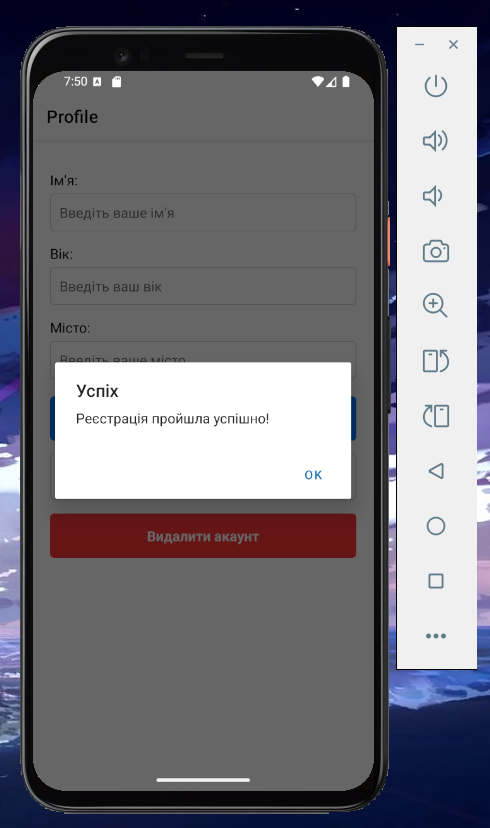
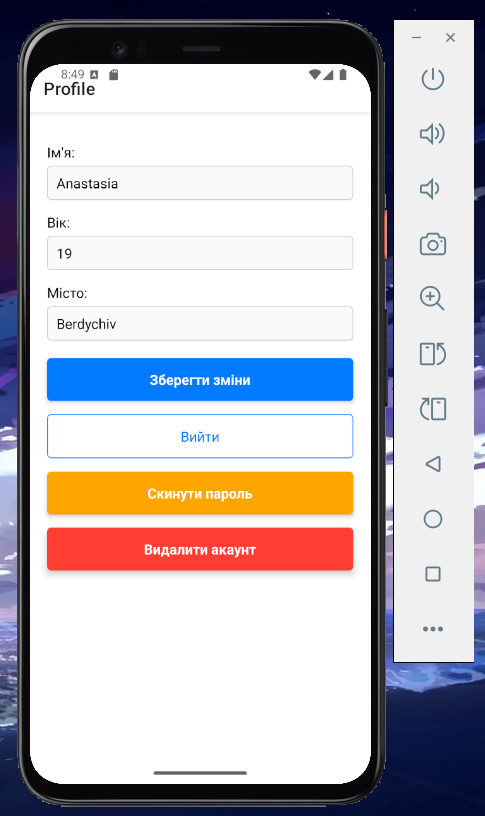
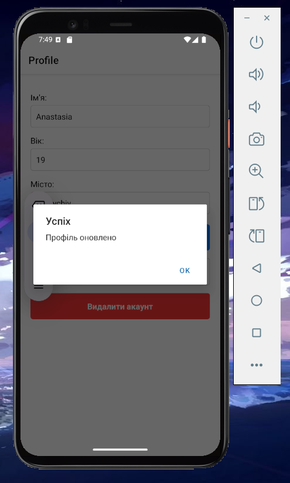
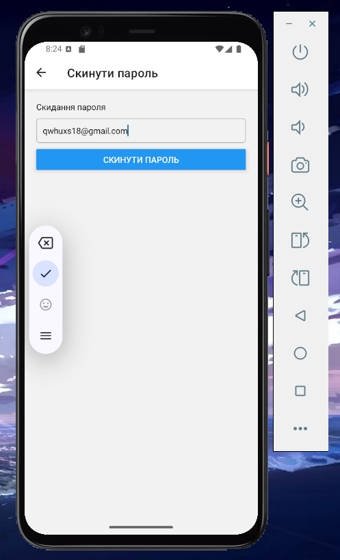
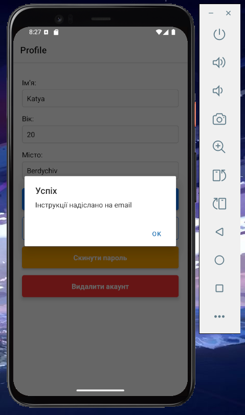
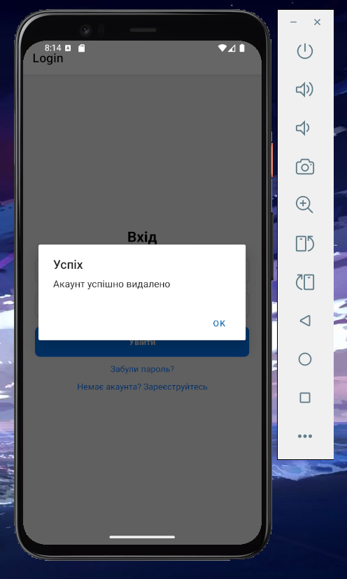
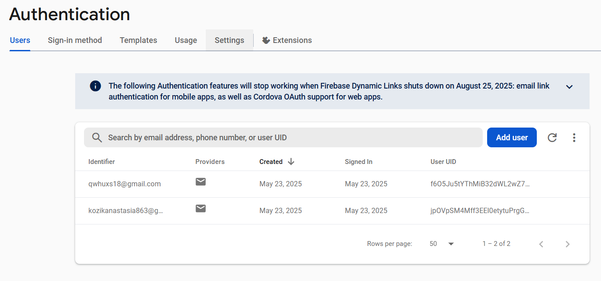

# Лабораторна робота №6

## Тема
Побудова авторизації та збереження персональних даних у React Native з використанням Firebase Authentication і Firestore

## Опис
Цей додаток реалізує повний цикл автентифікації користувача з використанням Firebase, включаючи:
- Реєстрацію нового користувача
- Вхід в систему
- Скидання пароля
- Оновлення профілю
- Видалення акаунту

## Функціонал

### Реєстрація нового користувача

### Вхід в систему
Користувач може увійти за допомогою email та пароля

### Скидання пароля

### Оновлення профілю
Користувач може оновити свої дані: ім'я, вік та місто

### Видалення акаунту

### Firebase Console

## Автор
[Козік Анастасія ВТк-24-1]
